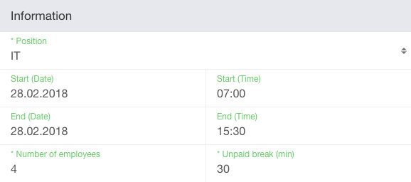
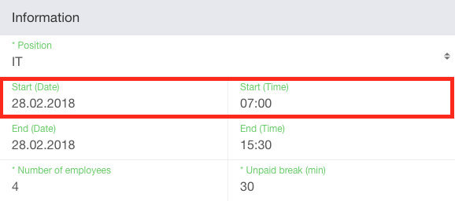
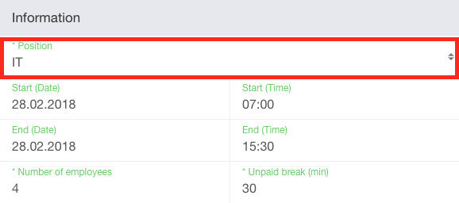
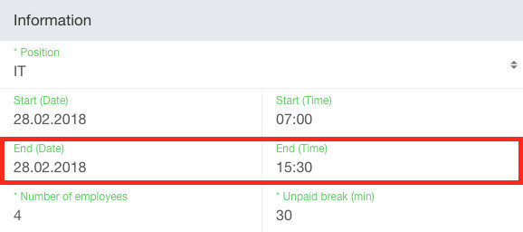
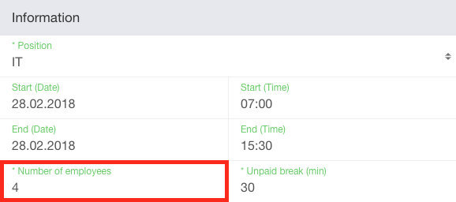
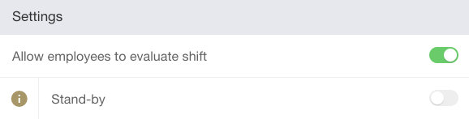
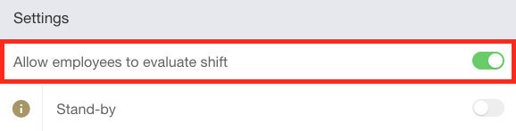
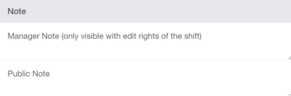
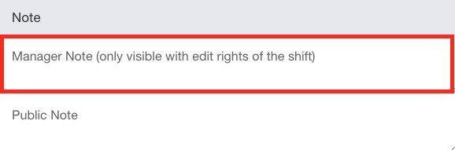

build: true

## Lets Talk about...
# API
## (of shyftplan)

---
build: true

## Roadmap
- What
- Why
- How
- At shyftplan

---
type: section

# What

---
build: true

## API stands for ...
- **A**pplication
- **P**rogramming
- **I**nterface

---

## What can i do with an API?

---
template: three-column

## Import Data


::center::

# ▶

::right::


---
template: three-column

## Export Data


::center::

# ◀

::right::


---
template: three-column

## Write Commands


::center::

# ▶

::right::


---
template: three-column

## Add notifications


::center::

# ◀

::right::


---
type: section

# Why

---

## Why do i need an API for that?

---
build: true

## UI
## (User Interface)

---
background: assets/ui-shift.png

&nbsp;

---
template: two-column



::right::

&nbsp;

---
template: two-column



::right::

&nbsp;

---
template: two-column


::right::

```
// ISO 8601
"2018-02-28T07:00:00.000+01:00"
```

---
template: two-column



::right::

&nbsp;

---
template: two-column


::right::

```
33291
```

---
type: section

# How

---

## How does the data from
## the API look like?

---
template: two-column


::right::

&nbsp;

---
template: two-column


::right::

```json
{
  "id": 6359714
}
```

---
template: two-column


::right::

```json
{
  "id": 6359714
}
```

---
template: two-column


::right::

```json
{
  "id": 6359714,
  "locations_position_id": 33291
}
```

---
template: two-column


::right::

```json
{
  "id": 6359714,
  "locations_position_id": 33291
}
```

---
template: two-column


::right::

```json
{
  "id": 6359714,
  "locations_position_id": 33291,
  "starts_at": "2018-02-28T07:00:00.000+01:00"
}
```

---
template: two-column



::right::

```json
{
  "id": 6359714,
  "locations_position_id": 33291,
  "starts_at": "2018-02-28T07:00:00.000+01:00"
}
```

---
template: two-column


::right::

```json
{
  "id": 6359714,
  "locations_position_id": 33291,
  "starts_at": "2018-02-28T07:00:00.000+01:00",
  "ends_at": "2018-02-28T15:30:00.000+01:00"
}
```

---
template: two-column



::right::

```json
{
  "id": 6359714,
  "locations_position_id": 33291,
  "starts_at": "2018-02-28T07:00:00.000+01:00",
  "ends_at": "2018-02-28T15:30:00.000+01:00"
}
```

---
template: two-column


::right::

```json
{
  "id": 6359714,
  "locations_position_id": 33291,
  "starts_at": "2018-02-28T07:00:00.000+01:00",
  "ends_at": "2018-02-28T15:30:00.000+01:00",
  "workers": 4
}
```

---
template: two-column



::right::

```json
{
  "id": 6359714,
  "locations_position_id": 33291,
  "starts_at": "2018-02-28T07:00:00.000+01:00",
  "ends_at": "2018-02-28T15:30:00.000+01:00",
  "workers": 4
}
```

---
template: two-column



::right::

```json
{
  "id": 6359714,
  "locations_position_id": 33291,
  "starts_at": "2018-02-28T07:00:00.000+01:00",
  "ends_at": "2018-02-28T15:30:00.000+01:00",
  "workers": 4
}
```

---
template: two-column


::right::

```json
{
  "id": 6359714,
  "locations_position_id": 33291,
  "starts_at": "2018-02-28T07:00:00.000+01:00",
  "ends_at": "2018-02-28T15:30:00.000+01:00",
  "workers": 4,
  "can_evaluate": true
}
```

---
template: two-column



::right::

```json
{
  "id": 6359714,
  "locations_position_id": 33291,
  "starts_at": "2018-02-28T07:00:00.000+01:00",
  "ends_at": "2018-02-28T15:30:00.000+01:00",
  "workers": 4,
  "can_evaluate": true
}
```

---
template: two-column



::right::

```json
{
  "id": 6359714,
  "locations_position_id": 33291,
  "starts_at": "2018-02-28T07:00:00.000+01:00",
  "ends_at": "2018-02-28T15:30:00.000+01:00",
  "workers": 4,
  "can_evaluate": true
}
```

---
template: two-column


::right::

```json
{
  "id": 6359714,
  "locations_position_id": 33291,
  "starts_at": "2018-02-28T07:00:00.000+01:00",
  "ends_at": "2018-02-28T15:30:00.000+01:00",
  "workers": 4,
  "can_evaluate": true,
  "note": "We need to do a release today"
}
```

---

```json
{
  "id": 6359714,
  "locations_position_id": 33291,
  "starts_at": "2018-02-28T07:00:00.000+01:00",
  "ends_at": "2018-02-28T15:30:00.000+01:00",
  "workers": 4,
  "can_evaluate": true,
  "note": "We need to do a release today"
}
```

---

```json linenums h1
{
  "id": 6359714,
  "locations_position_id": 33291,
  "starts_at": "2018-02-28T07:00:00.000+01:00",
  "ends_at": "2018-02-28T15:30:00.000+01:00",
  "workers": 4,
  "can_evaluate": true,
  "note": "We need to do a release today"
}
```

---

```json linenums h5
{
  "id": 6359714,
  "locations_position_id": 33291,
  "starts_at": "2018-02-28T07:00:00.000+01:00",
  "ends_at": "2018-02-28T15:30:00.000+01:00",
  "workers": 4,
  "can_evaluate": true,
  "note": "We need to do a release today"
}
```

---

```json linenums h3
{
  "id": 6359714,
  "locations_position_id": 33291,
  "starts_at": "2018-02-28T07:00:00.000+01:00",
  "ends_at": "2018-02-28T15:30:00.000+01:00",
  "workers": 4,
  "can_evaluate": true,
  "note": "We need to do a release today"
}
```

---

```json linenums h7
{
  "id": 6359714,
  "locations_position_id": 33291,
  "starts_at": "2018-02-28T07:00:00.000+01:00",
  "ends_at": "2018-02-28T15:30:00.000+01:00",
  "workers": 4,
  "can_evaluate": true,
  "note": "We need to do a release today"
}
```

---

```json linenums h6
{
  "id": 6359714,
  "locations_position_id": 33291,
  "starts_at": "2018-02-28T07:00:00.000+01:00",
  "ends_at": "2018-02-28T15:30:00.000+01:00",
  "workers": 4,
  "can_evaluate": true,
  "note": "We need to do a release today"
}
```

---

```json
{
  "id": 6359714,
  "locations_position_id": 33291,
  "starts_at": "2018-02-28T07:00:00.000+01:00",
  "ends_at": "2018-02-28T15:30:00.000+01:00",
  "workers": 4,
  "can_evaluate": true,
  "note": "We need to do a release today"
}
```

---

## How to get the data?

---

## [API Playground](https://shyftplan.com/swagger)

---
build: true

## API Action
- HTTP Method
- URL
- Parameters

---
build: true

## HTTP Method
- ```ts
  POST        // create
  ```
- ```ts
  GET         // read
  ```
- ```ts
  PUT // PATCH / update
  ```
- ```ts
  DELETE      // delete
  ```

---
build: true

## URL
- ```ts
  POST   // /api/v1/shifts
  ```
- ```ts
  GET    // /api/v1/shifts
  ```
- ```ts
  GET    // /api/v1/shifts/{id}
  ```
- ```ts
  PUT    // /api/v1/shifts/{id}
  ```
- ```ts
  DELETE // /api/v1/shifts/{id}
  ```

---
build: true

## Parameters
- ```
  ?key1={value1}&key2={value2}&key3={value3}
  ```
- ```
  ?user_email={email}&authentication_token={token}
  ```
- ```
  ?ids[]={id1}&ids[]={id2}
  ```

---

## [API Playground](https://shyftplan.com/swagger)

---
build: true

## Authentication
- Needed for every call
- With Email

---

## Authentication
- Needed for every call
- With Email & Authentication Token

---

## Authentication Token
- Can be generated on Employment Profile
- Or can be fetched with Email and Password

---

## [API Playground](https://shyftplan.com/swagger)

---
type: section

# At shyftplan

---

## Models

---

## User
- Stores the login data

---

## User

```json
{
  "id": 1337,             // Id of User
  "email": "tamino@...",  // Login mail address
  "created_at": ...,
  "updated_at": ...,      // Timestamps
  "deleted_at": ...
}
```

---

## Employment
- Connects *Company*s with *User*s

---

## Employment

```json
"id": 1337,             // Id of Employment
"user_id": 4711,        // Id of User
"company_id": 54,       // Id of Company
"is_employee": true,    // Is the user an employee?
"is_stakeholder": true, // Is the user an stakeholder?
"first_name": "Foo",    // First Name
"last_name": "Bar",     // Last Name
```

---

## Position
- Every *Company* can have multiple *Position*s.

---

## Position

```json
"id": 1337,             // Id of Position
"company_id": 54,       // Id of Company
"name": "Foo",          // Position Name
"description": "",      // Descripton
"color": "#aaeee1",     // Background color
"sort": 13,             // Used to order them
"text_color": "#000",   // Foreground color (black / white)
"note": ""              // Position Note
```

---

## Location
- Every *Company* can have multiple *Location*s.

---

## Location

```json
"id": 1337,             // Id of Location
"company_id": 54,       // Id of Company
"name": "Foo",          // Position Name
"sort": 13,             // Used to order them
```

---

## LocationsPosition
- Connects *Location*s with *Positions*s.

---

## LocationsPosition

```json
"id": 1337,             // Id of LocationsPosition
"location_id": 4711,    // Id of Location
"position_id": 815,     // Id of Position
"sort": 13,             // Used to order them
```

---

## EmploymentsPosition
- Connects *Employment*s with *LoctionsPosition*s.

---

## EmploymentsPosition

```json
"id": 1337,             // Id of EmploymentsPosition
"employment_id": 4711,  // Id of Location
"locations_position_id": 815, // Id of LoctionsPosition
```

---

## Shiftplan
- Collection of *Shift*s and related to an *Location*.

---

## Shiftplan

```json
"id": 1337,             // Id of Shiftplan
"location_id": 58,      // Id of Location
"starts_at": "yyyy-mm-dd", // Shiftplan goes from this date
"ends_at": "yyyy-mm-dd",   // to this date (both included)
"state": "published",   // State (published/unpublished)
"name": "Foo",          // Shiftplan name
```

---

## Shift
- Defines an working slot for an defined amount of *Employment*s.
- A shift is connected to an *Position* on the *Shiftplan*s *Location*.

---

## Shift

```json
"id": 1337,             // Id of Shift
"shiftplan_id": 4711,   // Id of Shiftplan
"locations_position_id": 815, // Id of LocationsPosition
"starts_at": "...",     // Shift goes from this time
"ends_at": "...",       // to this time (ISO 8601 format)
"workers": 1,           // Maximum amount of workers
"break_time": 0,        // Duration of breaks (in minutes)
"can_evaluate": true,   // Can be evaluated by employees
"note": null,           // Shift Note
"untimed": false,       // If shifts time counted?
"manager_note": null    // Manager Note
```

---

## StaffShift
- Connects *Employment*s with *Shift*s.

---

## StaffShift

```json
"id": 1337,             // Id of StaffShift
"shift_id": 4711,       // Id of Shift
"employment_id": 815,   // Id of Employment
"state": "no_evaluation", // Current Evaluation state
                          // - no_evaluation
                          // - done_evaluation
                          // - needs_evaluation
                          // - punchtimed
                          // - no_show
"total_minutes": 241,   // Working time (without break)
"total_payment": 50.21  // Sum of all payments
```

---

## Request
- Connects *Employment*s with *Shift*s.

---

## Request

```json
"id": 1337,             // Id of Request
"shift_id": 4711,       // Id of Shift
"employment_id": 815,   // Id of Employment
"type": "StaffRequest"  // Type of Request
                        // - StaffRequest
                        // - ChangeRequest
```

---

## Evaluation

```json
"id": 1337,             // Id of StaffShift
"shift_id": 4711,       // Id of Shift
"employment_id": 815,   // Id of Employment
"locations_position_id": 54, // Id of LocationsPosition
"shiftplan_id": 136,    // Id of Shiftplan
"location_id": 58,      // Id of Location
"position_id": 96,      // Id of Position
"user_id": 405,         // Id of User
"first_name": "Foo",    // First Name of Employment
"last_name": "Bar",     // Last Name of Employment
```

---

```json
"evaluation_starts_at": ..., // Evaluated Start of Shift
"evaluation_ends_at": ...,   // Evaluated End of Shift
"evaluation_break": 0,       // Break time in minutes
"evaluation_duration": 330,  // Working time in minutes
"state": "no_evaluation",    // State of Evaluation
"shift_note": null,               // Shift note
"admin_evaluation_note": null,    // Stakeholder Note
"employee_evaluation_note": null, // Employee Note
```

---

```json
"position": {
  "name": "Foo"        // Position Name
},
"location": {
  "name": "Bar"        // Location Name
},
"shift": {
  "starts_at": ...,    // Planned Shift Start
  "ends_at": ...,      // Planned Shift End
  "break_time": 0      // Planned Shift Break Time
}
```

---
type: section

# Bonus Track

---

## [API Playground](https://shyftplan.com/swagger)

---

## Open inspector
## ⌘ + ⌥ + i

---

## Fetch URL
- [Read data](http://api.jquery.com/jQuery.get/)
```
$.get('{url}', console.log);
```
- [Create data](http://api.jquery.com/jQuery.post/)
```
$.put('{url}', console.log);
```
- [Delete / Update data](http://api.jquery.com/jQuery.ajax/)
```
$.ajax('{url}', { options });
```

---

## Save data
- ```js
  var data;
  ```
- ```js
  $.get('{url}', res => data = res);
  ```
- ```js
  data
  ```
- ```js
  data.items
  ```

---

## Play around
- ```js
  _.pluck(data.items, 'id')
  ```
- ```js
  _.groupBy(data.items, 'state')
  ```
- ```js
  _.sum(data.items, 'total_payment')
  ```

---
background: assets/images/all-the-things.jpg

# &nbsp;
# Thats it

---

## Whats next?
- API Playground
- [shyftplan.com/swagger](https://shyftplan.com/swagger)
- Slides
- [lets-talk-about--api.taminomartinius.de](http://lets-talk-about--api.taminomartinius.de/)

---
type: section

# Questions?
