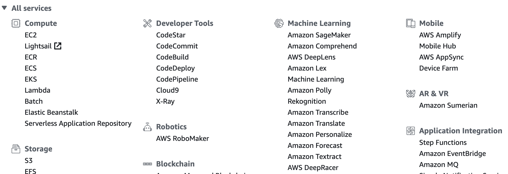
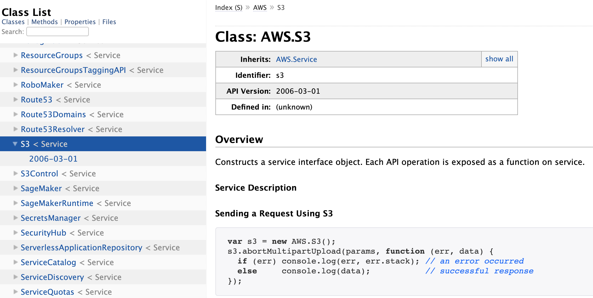
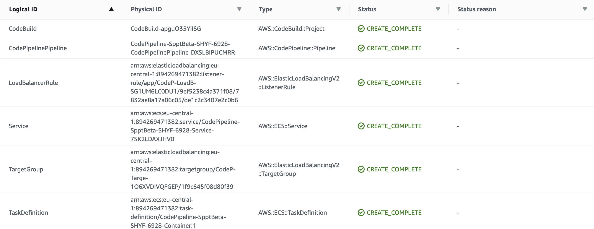
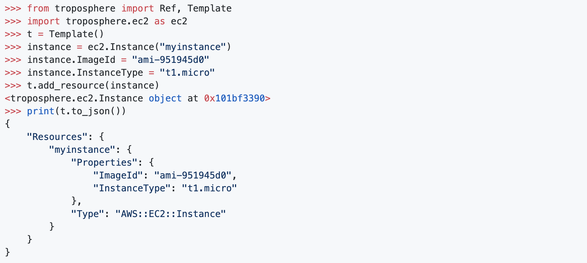
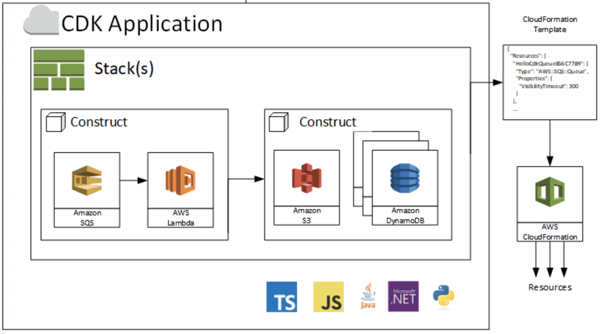
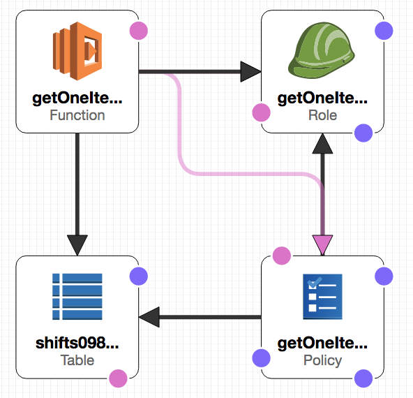
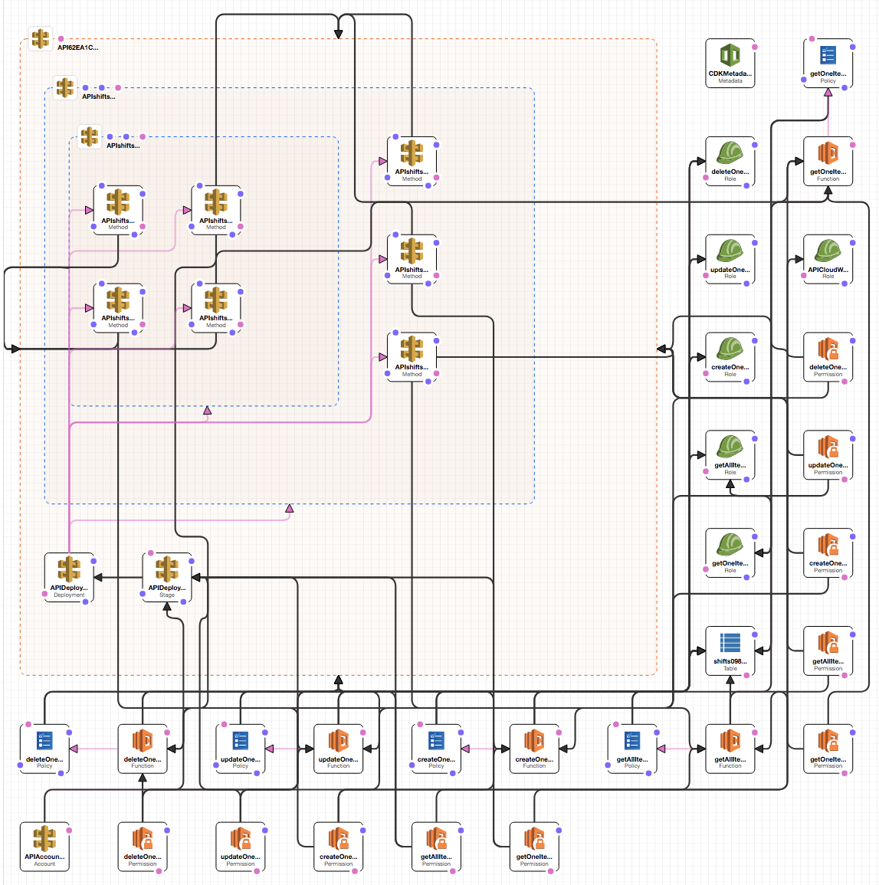
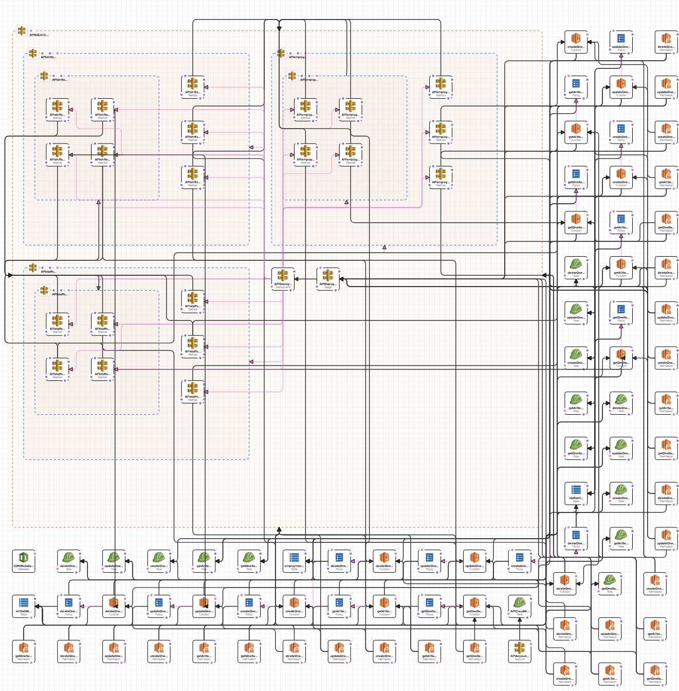

---
build: true

# Lets Talk about ...
## AWS Cloud Development Kit

---

# Lets Talk about ...
## CDK

---
build: true

# Agenda
- Motivation
- CloudFormation
- Demo
- Summary

---
build: true

# Motivation
## How to build Infrastructure within AWS

---
build: true

## Manual

- 👍 Easy to start
- 🤔 Not reproduceable
- 🤔 Error prone
- 🤔 Time consuming

---
build: true

## Scripting

- 👍  Reproduceable
- 🤔  Error handling?
- 🤔  How to update?
- 🤔  How to roll back?

---
build: true

## CloudFormation

- 👍  Easy to automate
- 👍  Easy to reproduce
- 😒  Complicated syntax
- 😒  No abstraction

---
build: true

## Document Object Models (DOMs)

- 💚  Real Code
- 👍  Desired State
- 😒  No Asset Mgmt.
- 😒  Limited languages

---
build: true

## Cloud Development Kit

- 💚  Real Code
- 💚  Asset Management
- 💚  Many languages
- 👍  Desired State

---

# Demo

---

## What are we building now

---
background: assets/images/philosoraptor.jpg
cover: true

# Is that all?

---

## We have also routing

---
background: assets/images/philosoraptor.jpg
cover: true

# Thats it?

---

## We have multiple routes

---

# Lets do it!

---
background: assets/images/like-a-boss.jpg

# &nbsp;

---

# Demo

---
background: assets/images/all-the-things.jpg

# &nbsp;
# Thats it

---

## Whats next?
- [CDK Documentation](https://docs.aws.amazon.com/cdk/api/latest/)
- [List of examples](https://github.com/aws-samples/aws-cdk-examples)

---
type: section

# Questions?
