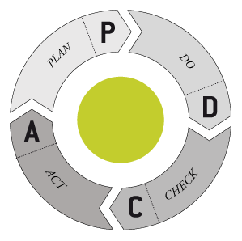

---
build: true

# Dev Department

---
build: true

## never change a running system
# &nbsp;
## if it ain't broke, don't fix it

---

## never change a running system?
# &nbsp;
## if it ain't broke, don't fix it?

---
background: assets/images/philosoraptor.jpg

&nbsp;

---

## But nobody said you can't improve it

---

# Continuous improvement

---
background: assets/images/like-a-boss.jpg

&nbsp;

---
build: true

## Scrum

---
build: true

## Scrum
- Refinement
- Kickoff
- Retro
- Daily Standup

---
build: true

## Not touched yet
- Workflow Scalability
- Meeting Efficiency

---

# Workflow Scalability

---
build: true

## Possible Improvements?
- No regular cadence
- A lot of coordination
- Every Ticket is touched by many people
- Unclear responsibilities

---
build: true

## How to solve
- Reduced dependencies
- Shorter Workflows
- Clear responsibilities
- Work with release candidates

---
build: true

## What will we change?
- New Jira Workflows
- Multiple Backlogs
- Changed GitHub Workflow

---

# Meeting Efficiency

---
build: true

## Possible Improvements?
- Often many participants
- Not everything is relevant to everybody
- Unstructured
- Goal is not always clear

---
build: true

## How to solve
- Divide and conquer
- Smaller meetings
- Shorter meetings
- Clear and focussed topics

---
build: true

## What will we change?
- Smaller and shorter daily standups
- Twice a week a department-wide exchange

---
build: true

## What will we learn?
- Dare to change
- Don't hesitate to touch the foundation

---

# You *can* change running systems
